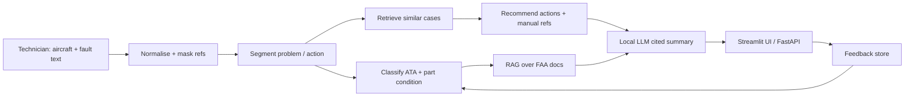

# AeroFix architecture

_Filled in as phases are completed. Final Mermaid diagram in Phase 10._

```mermaid
flowchart LR
    A[Technician: aircraft + fault text] --> B[Normalise + mask refs]
    B --> C[Segment problem / action]
    C --> D[Classify ATA + part condition]
    C --> E[Retrieve similar cases]
    E --> F[Recommend actions + manual refs]
    D --> G[RAG over FAA docs]
    F --> H[Local LLM cited summary]
    G --> H
    H --> I[Streamlit UI / FastAPI]
    I --> J[Feedback store] --> D
```
